# ARSW-Lab08 Escalabilidad

## Integrantes
- Andres Cardozo
- Juan d Gomez

# Paso a Paso

## Escalabilidad horizontal

### Crear Security Groups

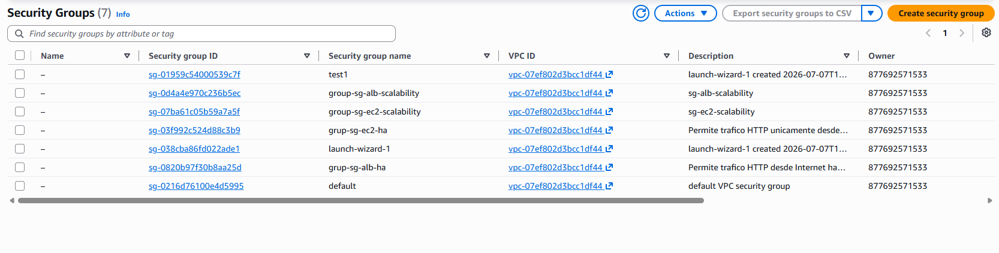

### Crear instancia base -  Verificar la instancia base

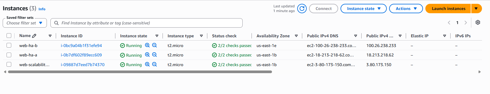

verificando:

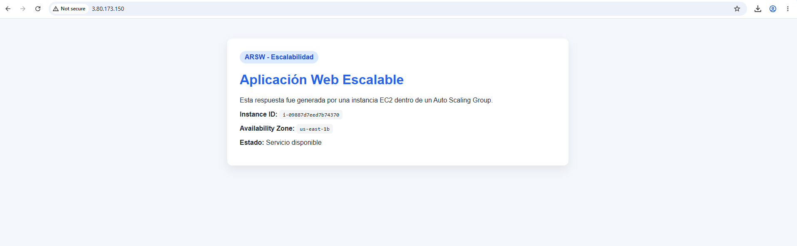

###  Crear una AMI de la instancia base

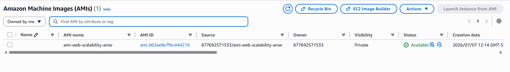

### Crear Launch Template

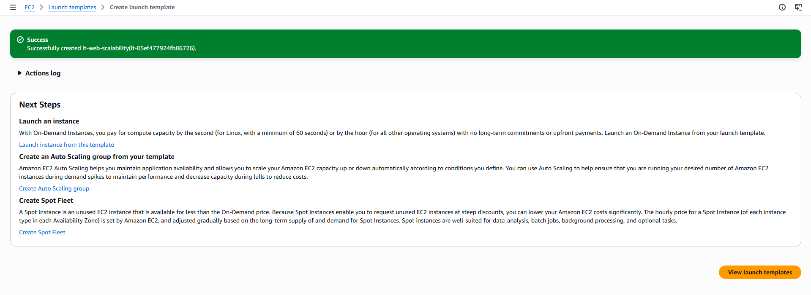

## Alta disponibilidad con Load Balancer

### Crear Target Group

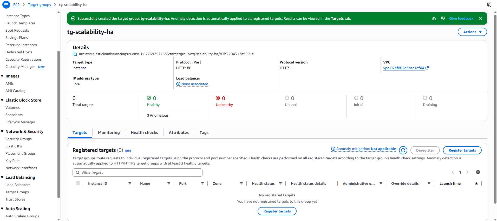

### Crear Application Load Balancer

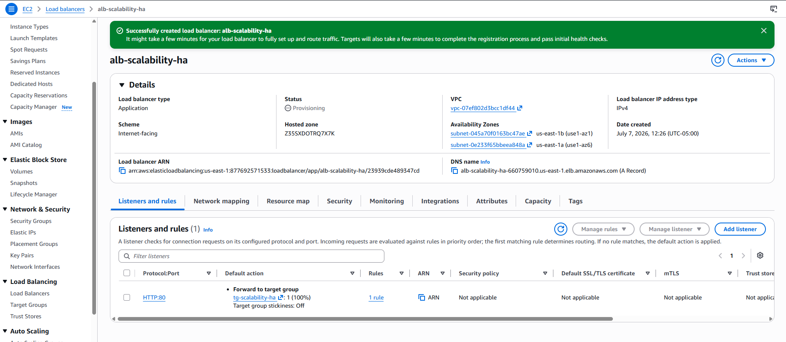

### Crear Auto Scaling Group

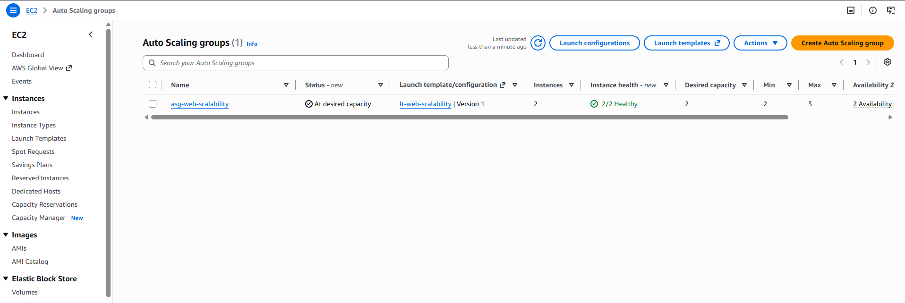

 nuevas instancias creadas por el Auto Scaling Group:

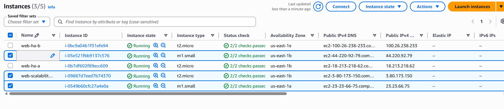

### Verificar Target Group

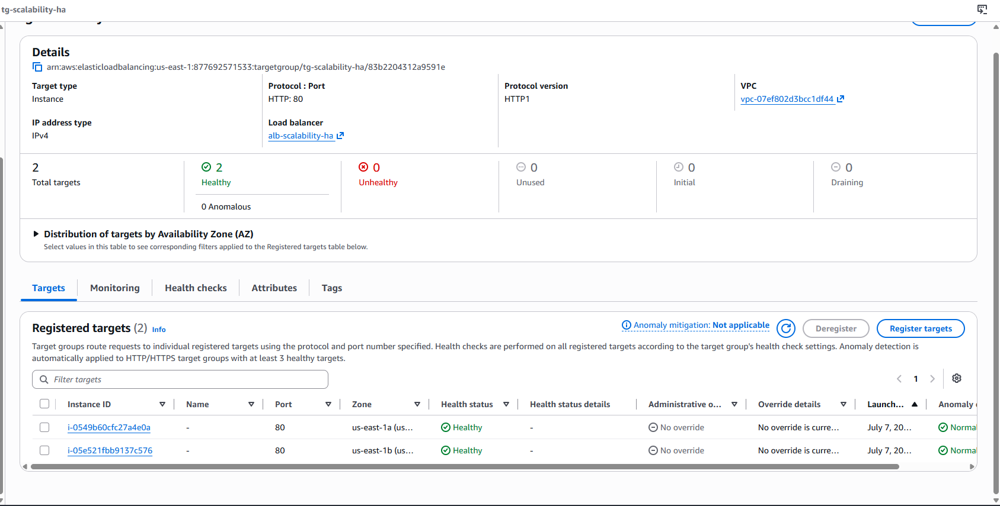

### Probar el Load Balancer

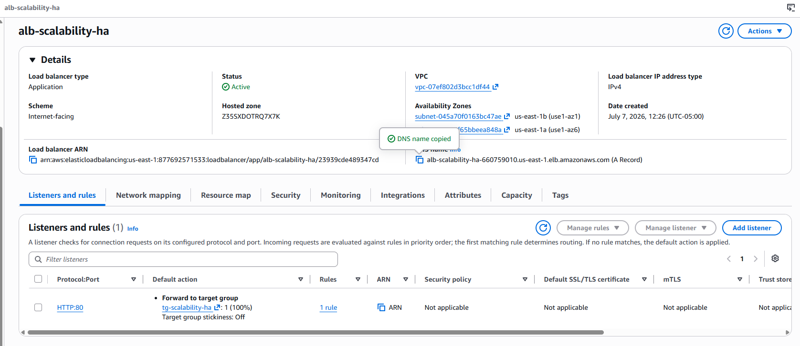

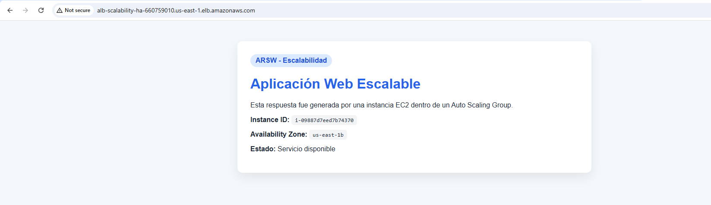

Al recargar la pagina o con el pequeño script podemos ver como varia entre intanceas

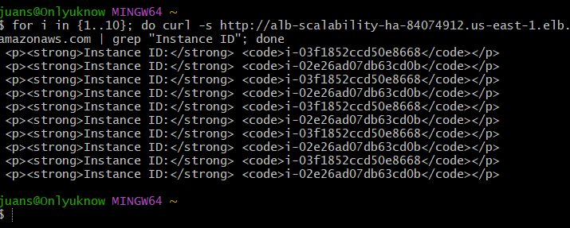

## Preguntas
## ¿Qué componente distribuye el tráfico?
 
El **Application Load Balancer (ALB)** es el encargado de distribuir el tráfico. Recibe todas las solicitudes de los usuarios a través de su DNS público y las reparte entre las instancias saludables registradas en el Target Group.
 
## ¿Qué componente decide cuántas instancias deben existir?
 
El **Auto Scaling Group (ASG)** toma esa decisión. Con base en la capacidad deseada configurada y en la política de escalamiento (target tracking sobre CPU al 50%), decide cuándo lanzar nuevas instancias o cuándo terminar las que sobran.
 
## ¿Qué componente verifica la salud de las instancias?
 
El **Target Group**, a través de sus health checks (`GET /health`). Es quien le informa al ALB qué instancias están en estado `Healthy` y pueden recibir tráfico, y cuáles están `Unhealthy` y deben excluirse del enrutamiento.
 
## ¿Por qué se seleccionan dos zonas de disponibilidad?
 
Para lograr redundancia física real. Si una zona completa de AWS falla, ya sea por un corte eléctrico, un problema de red o cualquier otro incidente, las instancias ubicadas en la otra zona siguen funcionando con normalidad y el sistema no queda completamente indisponible. Esta es la base de la alta disponibilidad a nivel de infraestructura.
 
## ¿Qué diferencia existe entre Target Group y Auto Scaling Group?
 
El Target Group responde a la pregunta *"¿a quién le envío el tráfico?"*, mientras que el Auto Scaling Group responde a la pregunta *"¿cuántas instancias debo tener corriendo?"*. El Target Group se encarga del registro de destinos y de ejecutar los health checks, sirviendo de referencia para el ALB al momento de enrutar. El Auto Scaling Group, en cambio, gestiona el ciclo de vida completo de las instancias: las lanza, las termina y las reemplaza según la demanda o su estado de salud. Cuando el ASG lanza una instancia nueva, la registra automáticamente en el Target Group; cuando la termina, la retira de ahí también.
 
## ¿Qué pasaría si una instancia falla?
 
El health check del Target Group deja de recibir la respuesta `OK` esperada en `/health`. Después de alcanzar el umbral configurado, que en este laboratorio son dos chequeos fallidos consecutivos, la instancia pasa a estado `Unhealthy`. El ALB deja de enviarle tráfico de inmediato y redirige todas las solicitudes hacia las instancias que sí están saludables. Al mismo tiempo, el Auto Scaling Group detecta que esa instancia no está saludable y la reemplaza automáticamente por una nueva, manteniendo así la capacidad deseada del grupo.
 
## ¿Qué pasaría si aumenta la carga?
 
El uso de CPU promedio del grupo comienza a subir. CloudWatch recolecta esa métrica y se la reporta al Auto Scaling Group. Si el valor supera el objetivo configurado, en este caso 50%, la política de target tracking dispara el lanzamiento de una nueva instancia, siempre respetando el máximo definido, que en este laboratorio es de tres instancias. Esa nueva instancia se registra automáticamente en el Target Group y, una vez que pasa a estado `Healthy`, comienza a recibir tráfico del ALB, ayudando a repartir la carga entre más servidores y aliviando la presión sobre las instancias existentes.

### Pruebas con hhtp (for i in {1..500}; docurl -s http://DNS_DEL_LOAD_BALANCER/loadhtml> /dev/null &donewait)

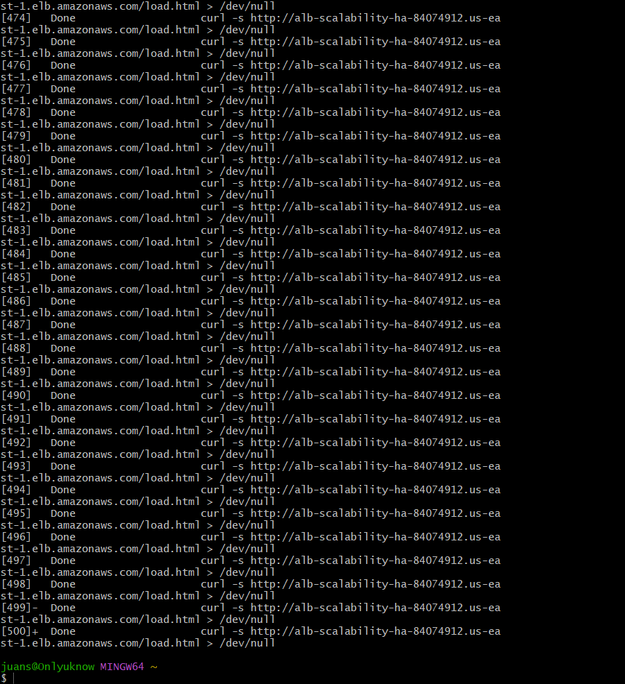

##  Observar el escalamiento
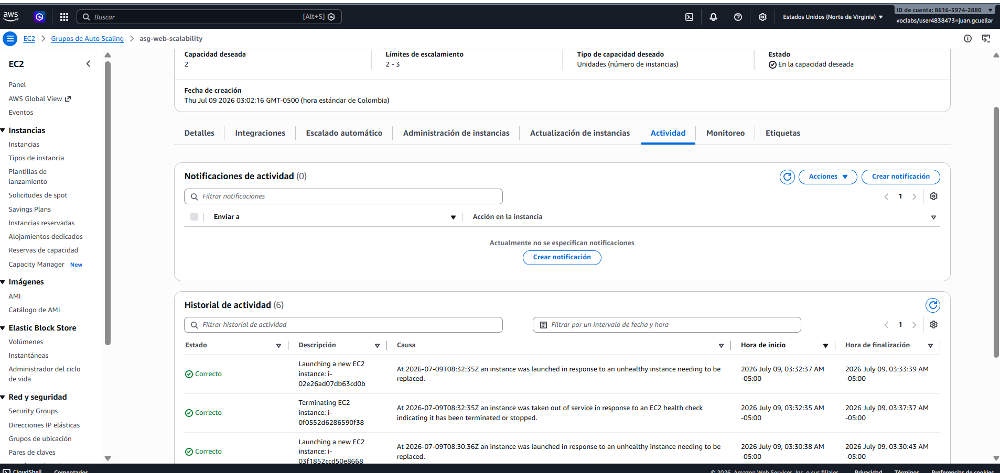
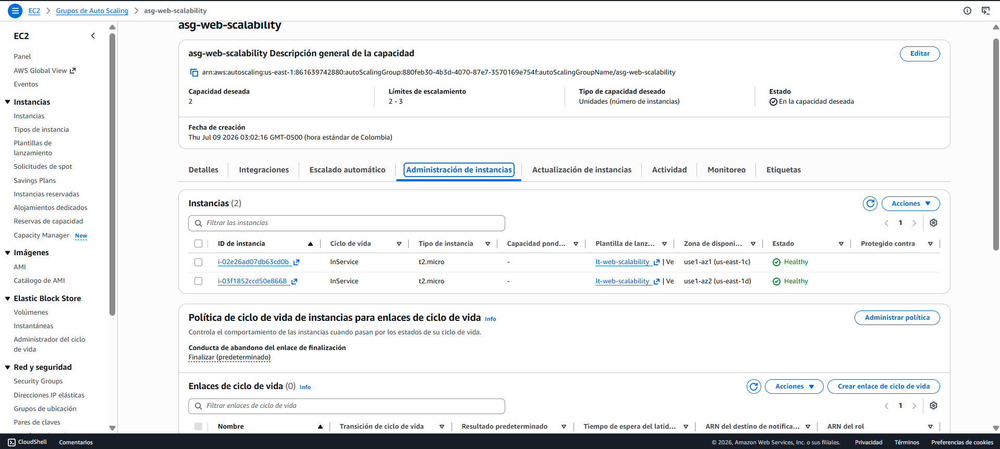
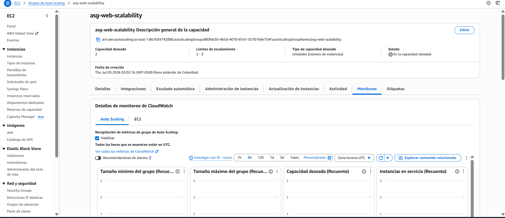

Al usar un script para generar peticiones masivas se logro que la capacidad deseada subiera a 3

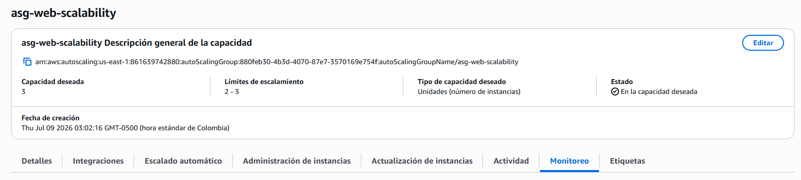

# Actividad 2: análisis del escalamiento

## ¿Qué métrica activó la política de escalamiento?

La métrica que activó la política fue **Average CPU Utilization** (utilización promedio de CPU del grupo). La política configurada es de tipo *target tracking scaling policy*, con un valor objetivo de 50%. Durante la prueba de carga, generada contra un endpoint CGI que ejecuta un cálculo intensivo en cada solicitud, la CPU llegó a un pico de **62.9%**, superando el umbral y disparando el evento de escalamiento.

Vale la pena mencionar que las primeras pruebas de carga, hechas contra una página HTML estática (`/load.html`), no lograron subir el CPU lo suficiente porque Apache responde ese tipo de contenido casi sin consumo de procesamiento. Solo al reemplazar el endpoint de prueba por un script CGI que realiza un cálculo pesado (`/cgi-bin/load.cgi`) se logró generar una carga de CPU real y sostenida.

## ¿Cuántas instancias había antes de la prueba?

Antes de la prueba, el grupo tenía **2 instancias** en servicio, que correspondían tanto a la capacidad deseada como a la mínima configurada (`Desired capacity: 2`, `Min: 2`, `Max: 3`).

## ¿Cuántas instancias hubo después?

Después de sostener la carga durante varios minutos, el Auto Scaling Group lanzó una instancia adicional, llevando el conteo a **3 instancias** en servicio, alcanzando así el máximo configurado para el grupo.

## ¿Cuánto tiempo tardó el sistema en reaccionar?

El sistema no reaccionó de inmediato. En un primer intento de carga sostenida durante 3 minutos, el CPU sí llegó a superar el 50%, pero el escalamiento no se disparó porque la política de target tracking necesita observar varios datapoints consecutivos por encima del umbral antes de tomar una decisión, y ese primer intento fue demasiado corto para acumularlos. Al repetir la prueba extendiendo la duración a 7 minutos de carga sostenida, el sistema sí reaccionó y lanzó la tercera instancia. Esto evidencia que Auto Scaling no responde a picos momentáneos de CPU, sino a una tendencia sostenida en el tiempo, lo cual tiene sentido como mecanismo de protección contra escalamientos innecesarios por variaciones puntuales de carga.

## ¿Qué limitación tiene usar solo CPU como métrica de escalamiento?

El CPU es una métrica útil pero incompleta, porque no siempre refleja con precisión la experiencia real del usuario ni el verdadero cuello de botella de la aplicación. Una aplicación puede estar respondiendo lento o incluso fallando solicitudes sin que el CPU se dispare, por ejemplo si el cuello de botella está en operaciones de red, en espera de I/O de disco, en conexiones de base de datos saturadas, o en memoria agotada. En esos casos, el sistema necesitaría más capacidad, pero la política basada únicamente en CPU nunca lo detectaría, dejando la aplicación degradada sin que Auto Scaling intervenga. Además, cargas ligeras en CPU pero intensivas en otros recursos (como aplicaciones que hacen muchas llamadas a APIs externas) quedarían mal cubiertas por esta métrica.

## ¿Qué otra métrica podría ser útil para una aplicación web?

Para una aplicación web, una métrica frecuentemente más representativa es **RequestCountPerTarget**, que mide cuántas solicitudes está atendiendo cada instancia registrada en el Target Group. Esta métrica refleja directamente la carga de tráfico real que percibe cada servidor, independientemente de si esa carga se traduce en alto uso de CPU o no.

Otras métricas complementarias también valiosas incluyen:

- **TargetResponseTime**: mide la latencia de respuesta del balanceador hacia los targets; un aumento sostenido puede indicar saturación aunque el CPU se mantenga bajo.
- **HTTPCode_Target_5XX_Count**: un aumento de errores del servidor puede señalar sobrecarga o fallas que ameritan más capacidad.
- **NetworkIn / NetworkOut**: útil para aplicaciones con tráfico intensivo de datos, donde el cuello de botella puede estar en el ancho de banda antes que en el procesador.
---

# Observabilidad con CloudWatch
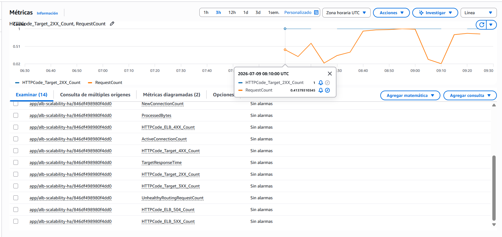

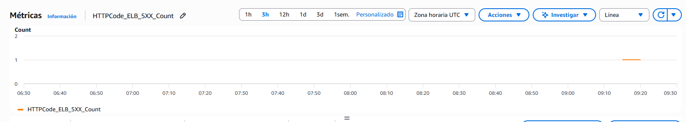

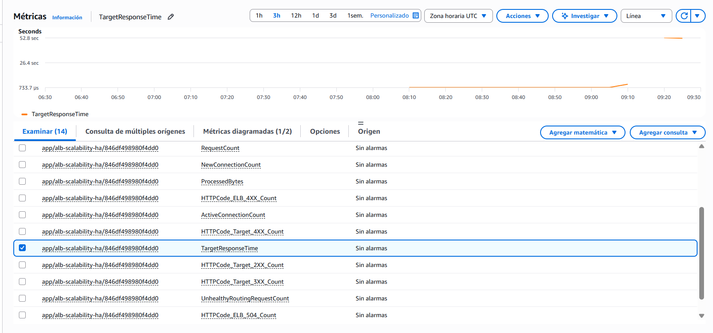

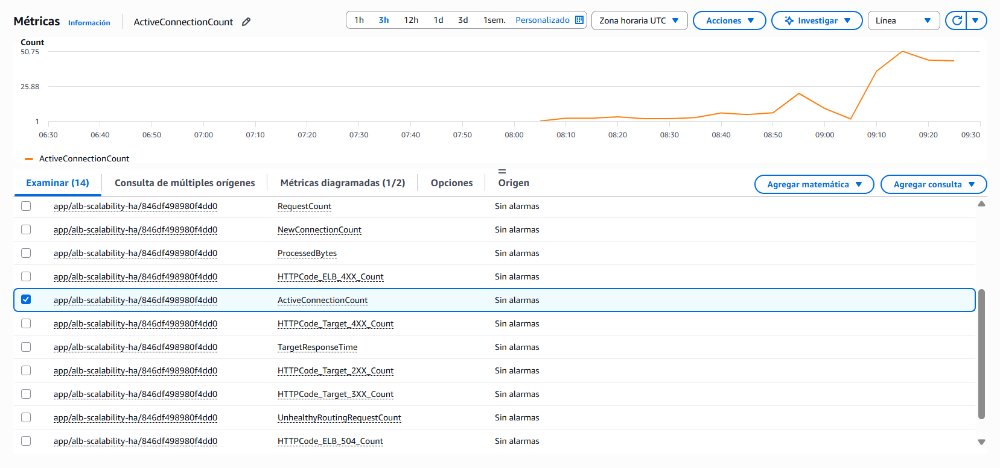

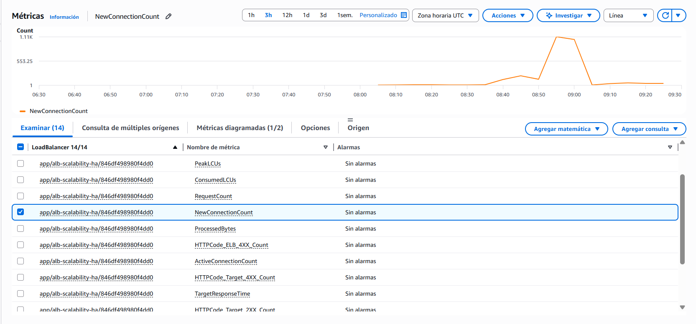

# Métricas del Auto Scaling Group

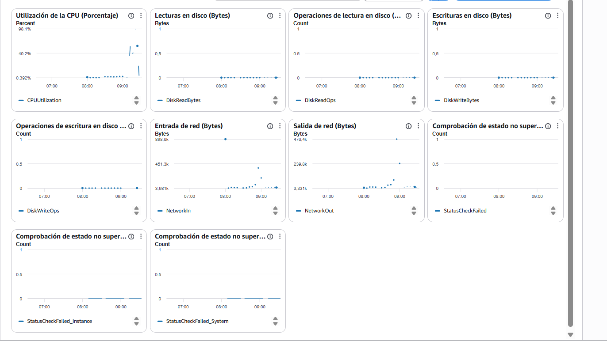

# Métricas de EC2

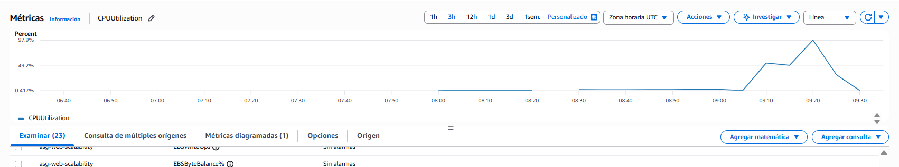
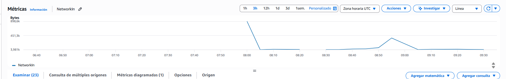
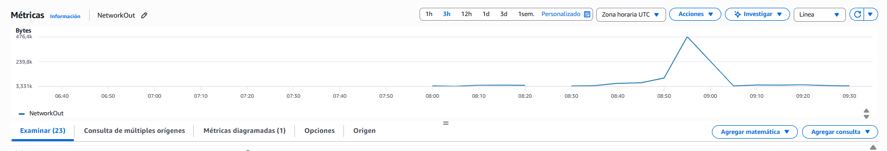
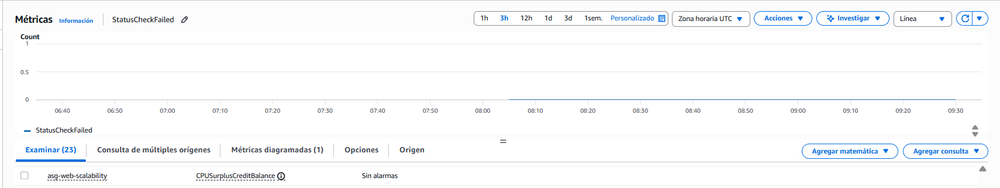

# Actividad 3: análisis de observabilidad

Se analizaron tres métricas provenientes de distintos servicios de AWS, para observar el comportamiento del sistema antes, durante y después de la prueba de carga generada contra el endpoint `/cgi-bin/load.cgi`.

---

## Métrica 1: CPUUtilization

- **Métrica observada:** CPUUtilization
- **Servicio AWS:** Amazon EC2 (a través del Auto Scaling Group)
- **Valor antes de la carga:** ~0.38% – 0.42%
- **Valor durante la carga:** pico de 67.9% – 68.1%
- **Valor después de la carga:** volvió a descender hacia valores bajos una vez cesó la carga
- **Interpretación:** el CPU refleja directamente el trabajo de procesamiento exigido por la aplicación. El salto de menos de 1% a más de 67% confirma que el endpoint CGI, al ejecutar un cálculo intensivo por cada solicitud, sí logró generar una carga de procesamiento real y sostenida, a diferencia de las pruebas iniciales contra contenido estático.
- **Decisión arquitectónica que soporta:** valida la política de *target tracking scaling* configurada con CPU al 50% como métrica de referencia, y respalda la decisión de que el Auto Scaling Group lanzara una tercera instancia para absorber la carga.

---

## Métrica 2: GroupDesiredCapacity

- **Métrica observada:** GroupDesiredCapacity
- **Servicio AWS:** Amazon EC2 Auto Scaling
- **Valor antes de la carga:** 2
- **Valor durante la carga:** se mantuvo en 2 durante los primeros minutos, mientras el sistema confirmaba la tendencia sostenida de CPU alto
- **Valor después de la carga:** 3
- **Interpretación:** esta métrica es la evidencia directa de la decisión tomada por Auto Scaling en respuesta al CPU elevado. El hecho de que no reaccionara de inmediato, sino después de varios minutos de carga sostenida, confirma que la política evita reaccionar a picos momentáneos y espera una tendencia consistente antes de escalar.
- **Decisión arquitectónica que soporta:** respalda la configuración de capacidad mínima y máxima (2–3), que define el rango dentro del cual el sistema puede crecer automáticamente sin intervención manual.

---

## Métrica 3: TargetResponseTime

- **Métrica observada:** TargetResponseTime
- **Servicio AWS:** Elastic Load Balancing (Application Load Balancer)
- **Valor antes de la carga:** ~733.7 microsegundos (prácticamente instantáneo)
- **Valor durante la carga:** pico de 52.8 segundos
- **Valor después de la carga:** la gráfica muestra el descenso de vuelta hacia valores bajos tras cesar la carga
- **Interpretación:** este es el dato más revelador de la prueba. Mientras las instancias servían contenido estático, el tiempo de respuesta era casi nulo. Al saturar el CPU con el endpoint CGI, el tiempo de respuesta se disparó hasta 52.8 segundos, un valor completamente inaceptable para un usuario real. Esto evidencia que, aunque el sistema eventualmente reaccionó escalando a una tercera instancia, hubo una ventana de tiempo en la que el servicio estuvo severamente degradado desde la perspectiva del usuario, incluso antes de que la métrica de CPU alcanzara el umbral necesario para disparar el escalamiento.
- **Decisión arquitectónica que soporta:** demuestra la limitación de depender únicamente de CPU como disparador de escalamiento, y respalda arquitectónicamente la recomendación de complementar la política con métricas orientadas a la experiencia del usuario, como TargetResponseTime o RequestCountPerTarget, que hubieran detectado el problema de forma más temprana que el CPU.

---

## Conclusión general

Las tres métricas cuentan la misma historia desde ángulos distintos: el CPU muestra la causa (procesamiento intensivo), GroupDesiredCapacity muestra la respuesta arquitectónica (más capacidad) y TargetResponseTime muestra el impacto real en el usuario mientras el sistema reaccionaba. La observabilidad combinada de estas métricas permite entender no solo si el sistema escaló, sino qué tan bien protegió la experiencia del usuario mientras lo hacía, algo que ninguna métrica por sí sola habría explicado completamente.

---

# Simular falla de una instancia

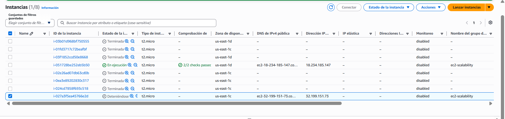

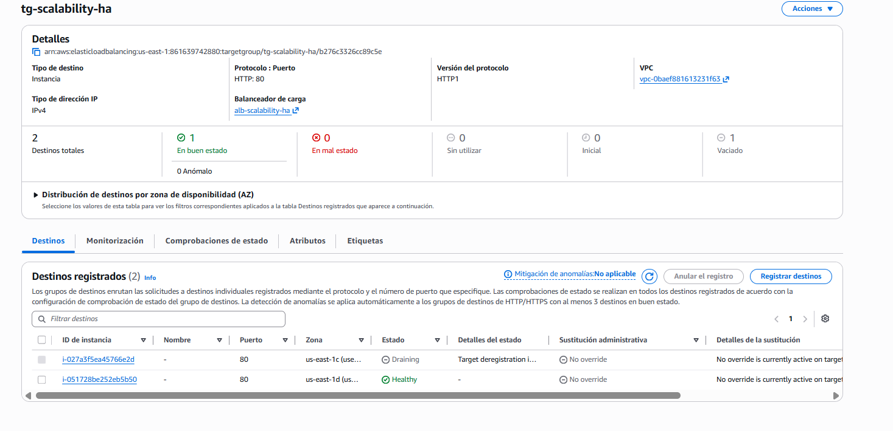

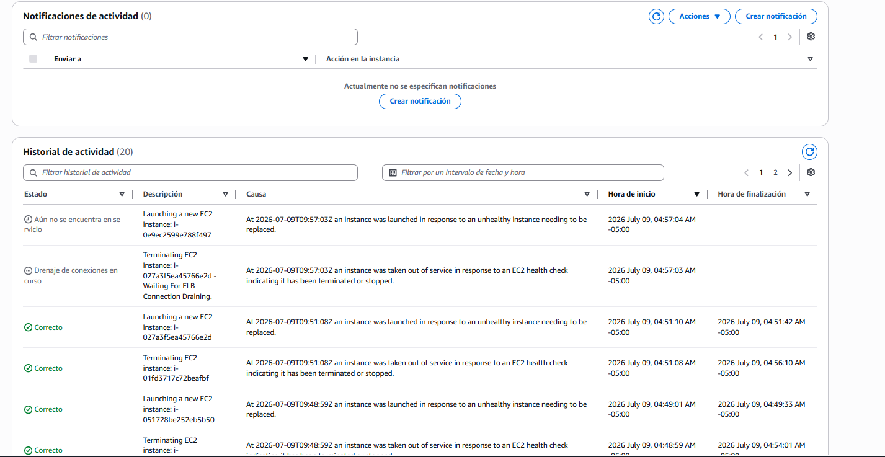

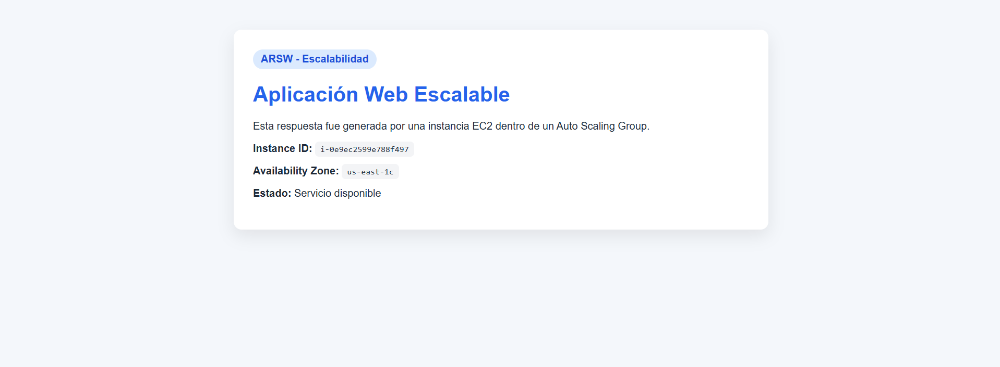
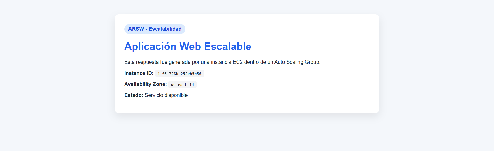

# Actividad 4: análisis de alta disponibilidad

## ¿Qué ocurrió cuando se detuvo una instancia?

Al detener manualmente una de las instancias del Auto Scaling Group, el Target Group dejó de recibir respuestas válidas de su health check (`GET /health`). El historial de actividad del Auto Scaling Group registró el evento correspondiente, indicando que la instancia fue retirada de servicio *"in response to an EC2 health check indicating it has been terminated or stopped"*. Segundos después, el Auto Scaling Group lanzó automáticamente una instancia de reemplazo, registrando el evento *"Launching a new EC2 instance... in response to an unhealthy instance needing to be replaced"*.

## ¿El Load Balancer siguió respondiendo?

Sí. Durante todo el proceso de detección y reemplazo, las solicitudes contra el DNS del Application Load Balancer continuaron respondiendo correctamente, sin interrupciones visibles para el usuario. El ALB simplemente dejó de enviar tráfico a la instancia caída y lo concentró en la instancia que seguía saludable, mientras el reemplazo se completaba en segundo plano.

## ¿El Target Group detectó la falla?

Sí. El Target Group identificó la pérdida de la instancia a través de su mecanismo de health check, y el propio log de actividad del Auto Scaling Group documenta explícitamente que la causa de la baja fue un chequeo de salud fallido, no una acción manual directa sobre el grupo.

## ¿El Auto Scaling Group lanzó una nueva instancia?

Sí. El Auto Scaling Group reaccionó de forma automática, sin intervención manual, lanzando una nueva instancia para restablecer la capacidad deseada del grupo. Este comportamiento se repitió de forma consistente en el historial de actividad, confirmando que el mecanismo de reemplazo automático funciona de manera confiable.

## ¿Qué diferencia existe entre ocultar una falla y recuperarse de una falla?

Ocultar una falla significa que el sistema logra que el usuario no perciba el problema en el momento, pero el componente dañado sigue fuera de servicio de forma permanente, dejando al sistema con menos capacidad real y más vulnerable ante una segunda falla. Es lo que ocurre, por ejemplo, con un balanceador de carga simple sin Auto Scaling: si una instancia cae, el tráfico se redirige a la que queda sana y el usuario no nota nada, pero la capacidad total del sistema quedó reducida indefinidamente hasta que alguien intervenga manualmente.

Recuperarse de una falla, en cambio, implica que el sistema no solo enmascara el problema ante el usuario, sino que además restaura activamente su capacidad original, sin depender de que un humano lo note o actúe. Esto es justamente lo que se observó en la prueba: el Auto Scaling Group no se limitó a dejar de enviar tráfico a la instancia caída, sino que lanzó una nueva instancia para reponer la capacidad perdida, devolviendo al sistema a su estado deseado de forma autónoma.

## ¿Qué atributo de calidad se evidencia en esta prueba?

El atributo de calidad principal que se evidencia es la **disponibilidad**, específicamente en su forma de **resiliencia** o **tolerancia a fallos**, ya que el sistema continuó operando pese a la caída de un componente. Sin embargo, la prueba también evidencia el atributo de **elasticidad** o **auto-recuperación** (self-healing), un aspecto más avanzado que la simple disponibilidad, porque el sistema no solo sobrevivió a la falla, sino que restauró automáticamente su capacidad original sin intervención humana, gracias a la integración entre el Application Load Balancer, el Target Group y el Auto Scaling Group.

## Relación entre los tres conceptos
 
| Concepto | Componente AWS relacionado | Evidencia en el laboratorio |
|---|---|---|
| Escalabilidad | Auto Scaling Group | La capacidad deseada pasó de 2 a 3 instancias al sostener el CPU por encima del 50%. |
| Alta disponibilidad | ALB + múltiples AZ | El ALB siguió respondiendo sin interrupción al detener una instancia, redirigiendo tráfico a la zona sana. |
| Observabilidad | CloudWatch Metrics | Tres métricas combinadas revelaron causa, respuesta arquitectónica e impacto real en el usuario. |
| Detección de fallos | Health checks | El Target Group marcó la instancia detenida como `Unhealthy` y la excluyó del enrutamiento. |
| Recuperación | Auto Scaling Group | El log de actividad confirma el lanzamiento automático de una instancia de reemplazo. |
| Distribución de carga | Load Balancer | Las pruebas con `curl` en loop mostraron respuestas alternando entre distintos Instance IDs. |
 
---
 
## Propuesta de mejora para producción
 
La arquitectura implementada demuestra los mecanismos fundamentales de escalabilidad, alta disponibilidad y observabilidad, pero está diseñada para un entorno de laboratorio con restricciones de permisos. Antes de llevarla a producción, se proponen las siguientes mejoras:
 
### Seguridad de red
 
Las instancias EC2 actualmente son públicas, con IP propia expuesta directamente a internet (aunque el tráfico se filtra por Security Groups). En producción, las instancias deberían colocarse en **subredes privadas**, sin IP pública, dejando al ALB como único punto de entrada desde internet. Esto requeriría un **NAT Gateway** (o VPC Endpoints para servicios específicos de AWS) para que las instancias privadas puedan seguir descargando paquetes o accediendo a APIs externas sin estar expuestas directamente.
 
### Cifrado en tránsito
 
El laboratorio opera únicamente sobre HTTP. En producción es indispensable agregar **HTTPS** mediante un certificado gestionado por **AWS Certificate Manager (ACM)**, configurando el listener del ALB en el puerto 443 y redirigiendo automáticamente el tráfico HTTP hacia HTTPS.
 
### Política de escalamiento más robusta
 
Como evidenció la Actividad 3, depender únicamente de `CPUUtilization` dejó una ventana de casi un minuto de latencia severa antes de que el sistema reaccionara. En producción se recomienda usar (o combinar) `RequestCountPerTarget` o `TargetResponseTime` como métrica de escalamiento, ya que responden más directamente a la experiencia real del usuario. También conviene evaluar políticas de *step scaling* combinadas con target tracking para reaccionar más agresivamente ante picos súbitos.
 
### Observabilidad activa: alarmas y notificaciones
 
Actualmente las métricas se revisan manualmente en CloudWatch. En producción se deberían configurar **CloudWatch Alarms** que notifiquen automáticamente (vía SNS, correo o integraciones con Slack/PagerDuty) cuando el `TargetResponseTime`, la tasa de errores 5XX o el `HealthyHostCount` salgan de rangos aceptables, permitiendo detectar problemas antes de que impacten masivamente a los usuarios.
 
### Logs centralizados
 
El laboratorio no centraliza logs de aplicación. Se recomienda enviar los logs de Apache (y de la aplicación en general) a **CloudWatch Logs**, y habilitar los **access logs del ALB** hacia un bucket S3, lo cual permite análisis posterior, auditoría y correlación de incidentes.
 
### Base de datos altamente disponible
 
Este laboratorio no incluye una capa de datos, pero cualquier aplicación real la necesitará. Se recomienda usar **Amazon RDS en configuración Multi-AZ** (o Aurora), para que la base de datos también cuente con failover automático entre zonas de disponibilidad, evitando que se convierta en el nuevo punto único de falla de la arquitectura.
 
### Despliegues sin caída de servicio
 
Actualmente, actualizar el Launch Template requiere terminar instancias manualmente para forzar el reemplazo, lo cual genera capacidad reducida temporalmente. En producción se debería usar la funcionalidad de **Instance Refresh** del Auto Scaling Group, o adoptar una estrategia de **despliegue blue/green**, reemplazando instancias de forma gradual y controlada, con posibilidad de rollback automático si las nuevas instancias fallan sus health checks.
 
### Infraestructura como código
 
Toda la infraestructura de este laboratorio se creó manualmente desde la consola web, lo cual es propenso a errores de configuración (como los que se presentaron durante las pruebas: reglas de Security Group mal configuradas, zonas de disponibilidad no alineadas entre el ALB y las instancias, o errores de sintaxis en el User Data). En producción, esta arquitectura debería definirse con **Terraform** o **AWS CloudFormation**, permitiendo versionar los cambios, revisarlos antes de aplicarlos, y reproducir el entorno de forma consistente entre ambientes (desarrollo, staging, producción).

---
# Limpieza de recursos
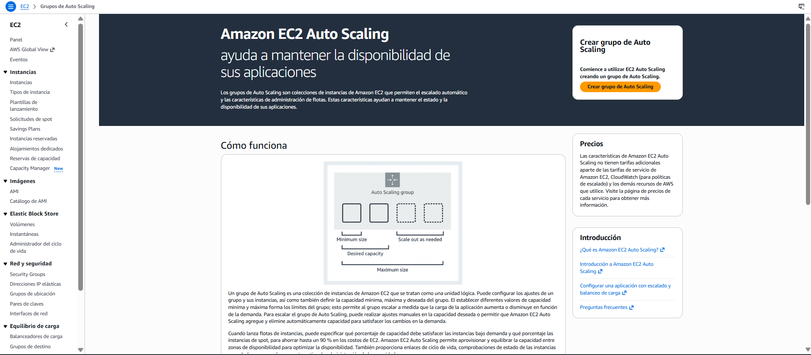
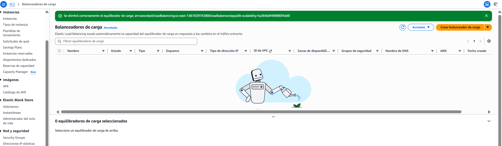
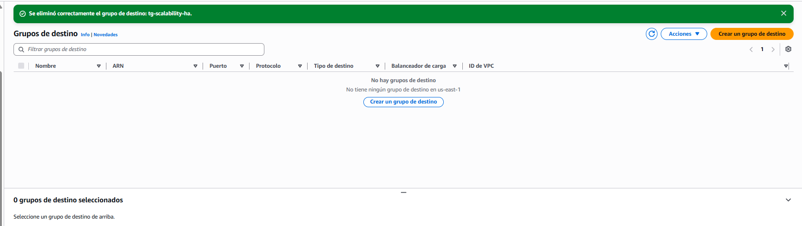
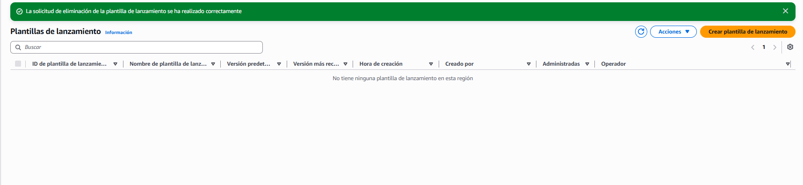
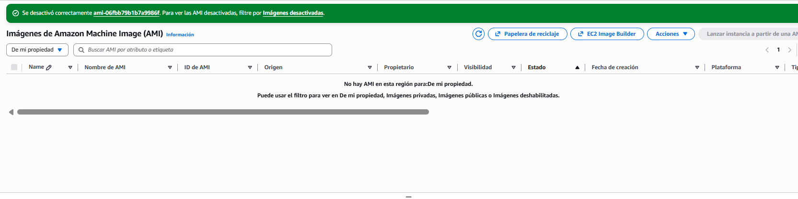
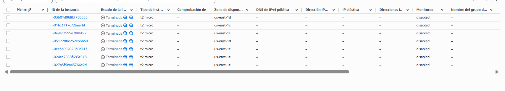
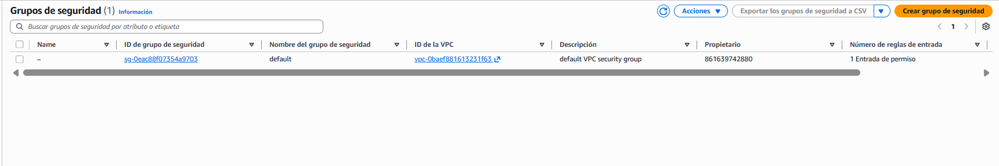